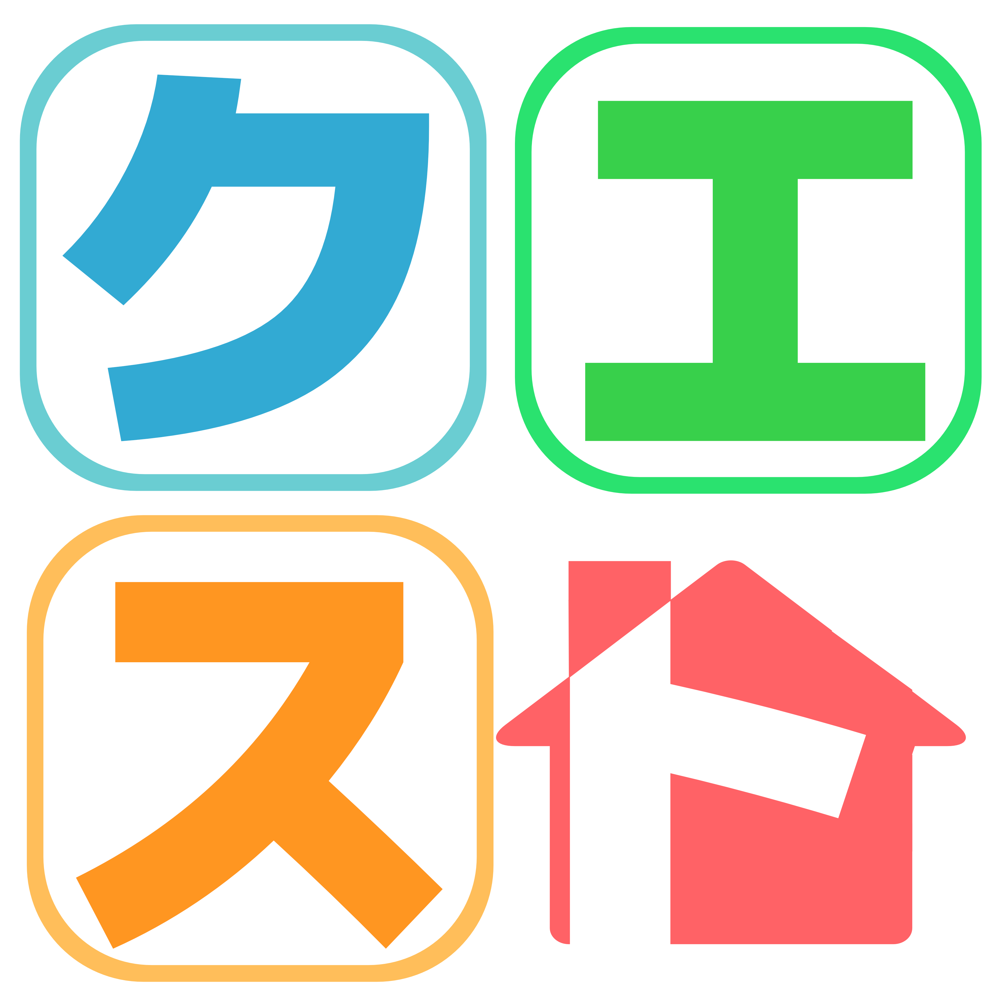

# おうちクエスト
<a href="https://www.youtube.com/watch?v=G5rULR53uMk">

</a>

## 製品概要
### 子育て Tech

### 背景（製品開発のきっかけ、課題等）
全チームメンバーが子供のころのお手伝いが嫌いであった。チームメンバーの現小学生の従妹もお手伝いが嫌いらしい。そこで、どうせなら楽しくお手伝いをしてほしい。そして、そこから親子間のコミュニケーションのきっかけになればと思いプロダクトを開発した。

### 製品説明（具体的な製品の説明）

### 概要
親がスマホでクエストを出し、子供がそのクエストを達成してポイントをゲットし、そのポイントでご褒美をもらえるアプリ。子供が楽しくお手伝いをしつつ、親子間のコミュニケーションを増やすことを目的としている。

### 特長

#### 1. ユーザの目線に立っている
最高のUI/UXを提供するために、実際にアプリを使用するユーザの目線に立ってUIデザインを行った。特に、子供向け画面は何度も議論し子供でも無理なく使えるUIデザインを行った。

#### 2. プッシュ通知がある
クエスト追加時やご褒美のリクエスト時にプッシュ通知が飛びいち早く知れるようにした。

### 解決出来ること
* 子供は目標に向かって楽しくお手伝いできる
* 親は円滑に子供にお手伝いさせることができる
* 親子間でのコミュニケーションが活発になる

### 今後の展望
スマートスピーカーなどと連携して、VUIを用いて情報をやり取りする機能の追加。

## 開発内容・開発技術
### 活用した技術

#### フレームワーク・ライブラリ・モジュール
* Ruby on Rails
* Angular
* ionic

### 独自開発技術（Hack Dayで開発したもの）
#### 2日間に開発した独自の機能・技術
* Web App

* commit_id: c90ac4a267ececc10973728fafd79fa4933ee3c0